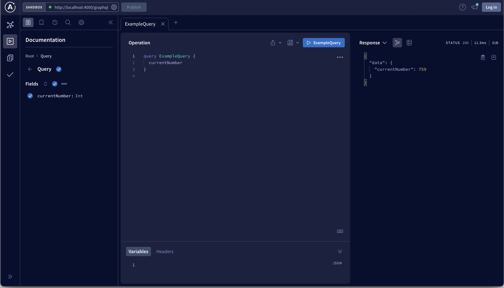
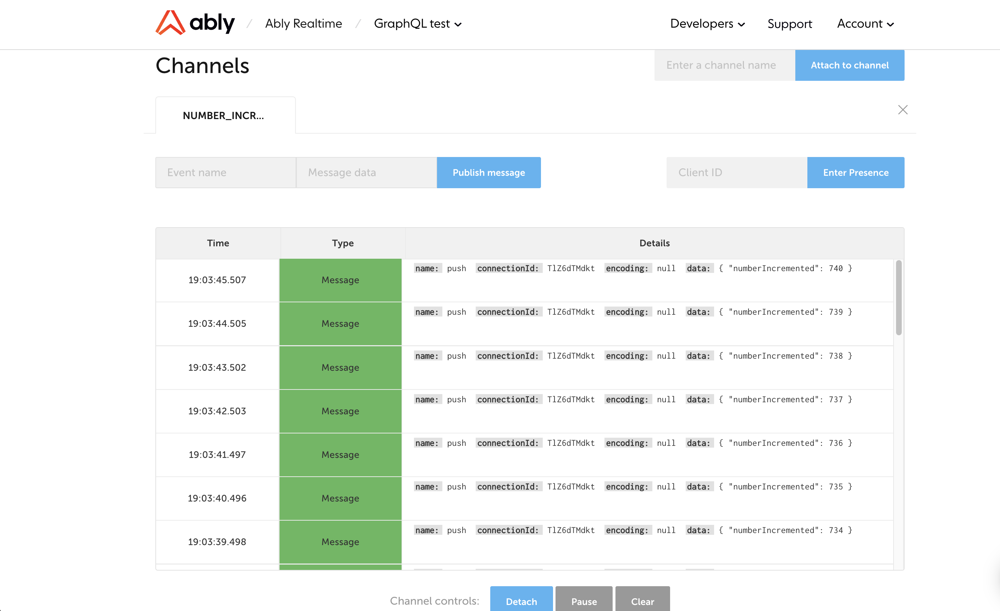

# GraphQL Ably PubSub

This is an [Ably](https://ably.com) implementation of the `PubSubEngine` base-class to enable [Subscriptions](https://www.apollographql.com/docs/apollo-server/data/subscriptions) in Apollo Server. This implementation uses Ably as the message transport for the WebSocket portion of Apollo Subscriptions, allowing you to use the feature without managing and maintaining your own WebSocket Server.

Please consult the [Apollo Server documentation](https://www.apollographql.com/docs/apollo-server/data/subscriptions) for more information on how to use this feature.

## Pre-Requirements
In order to run use the AblyPubSub class, you will need an Ably API key. If you are not already signed up, you can [sign up now for a free Ably account](https://www.ably.com/signup). Once you have an Ably account:

1. Log into your app dashboard.
2. Under **“Your apps”**, click on **“Manage app”** for any app you wish to use for this tutorial, or create a new one with the “Create New App” button.
3. Click on the **“API Keys”** tab.
4. Copy the secret **“API Key”** value from your Root key, we will use this to configure our app.

### Configuring your Ably API keys

#### For local development

You need to create a `.env` file in the root with a variable defined called `ABLY_API_KEY` to store your secret.
You can do this from the command line if you like:

```bash
echo ABLY_API_KEY=YOUR-API-KEY-HERE > .env
```

## Installation

```bash
npm install --save @ably-labs/graphql-ably-pubsub
```

## Usage

You can run a full example by running

```bash
npm run start
```

Open up the Apollo GraphQL studio in your web browser (http://localhost:4000/graphql) and click the "Query your server" button. Then, update the ExampleQuery to be the following:

```
query ExampleQuery {
  currentNumber
}
```

And run the query. Re-run the query and you'll see the `currentNumber` value changing.



To see the updates in realtime, go to the Ably dashboard and select the Ably application you've used for the GraphQL example and select the "Dev console" tab. Attach to the channel `NUMBER_INCREMENTED` and you'll see the updates coming in as new events are triggered on that channel via the GraphQL subscription.



But the more important parts of the example are shown here:

```js
import AblyPubSub from "./index.js"; 

// The AblyPubSub constructor accepts all the same configuration options as the Ably JS SDK.
// Make sure to keep your API key safe! Here, we're loading it from the environment.
const pubsub = new AblyPubSub({ key: process.env.ABLY_API_KEY });

// ...

// Resolver map
const resolvers = {
  Query: {
    currentNumber() {
      return currentNumber;
    },
  },
  Subscription: {
    numberIncremented: {
      subscribe: () => pubsub.asyncIterator(["NUMBER_INCREMENTED"]),
    },
  },
};

// ...

// In the background, increment a number every second and notify subscribers when
// it changes.
let currentNumber = 0;
function incrementNumber() {
  currentNumber++;
  pubsub.publish("NUMBER_INCREMENTED", { numberIncremented: currentNumber });
  setTimeout(incrementNumber, 1000);
}
// Start incrementing
incrementNumber();
```

## About Ably

Ably makes it simple for developers to build live experiences for millions of people. Our platform provides a highly available, massively scalable, low latency, globally distributed WebSockets infrastructure - at the call of an API. 

We provide serverless pub/sub messaging with unique data integrity guarantees, delivered at the edge over WebSockets. Our highly reliable, elastic infrastructure was specifically designed for building high-scale realtime web and mobile applications. We free engineers to focus on building core functionality, rather than having to provision and maintain WebSocket servers and cloud infrastructure. 

## Example

This example is based on the ["Subscriptions in Apollo Server v3" sample](https://www.apollographql.com/docs/apollo-server/data/subscriptions/).

The text below is lifted directly from the sample, with the `AblyPubSub` implementation of the `PubSubEngine` replacing the original `PubSub` implementation referenced in the official documentation as "not fit for production use".

This example demonstrates a basic subscription operation in Apollo Server.
[See the docs on subscriptions](https://www.apollographql.com/docs/apollo-server/data/subscriptions/)

The example server exposes one subscription (`numberIncremented`) that returns
an integer that's incremented on the server every second.

After you start up this server, you can test out running a subscription with the
Apollo Studio Explorer by following the link from http://localhost:4000/graphql
to the Apollo Sandbox. You may need to edit the Apollo Sandbox connection
settings to select the
[`graphql-ws` subscriptions implementation](https://www.apollographql.com/docs/studio/explorer/additional-features/#subscription-support).
You'll see the subscription's value update every second.

```graphql
subscription IncrementingNumber {
  numberIncremented
}
```

## Run locally

```shell
npm install
npm run start
```

## Run in CodeSandbox

<a href="https://codesandbox.io/s/github/ably-labs/graphql-ably-pubsub?fontsize=14&hidenavigation=1&initialpath=%2Fgraphql&theme=dark">
  
</a>
